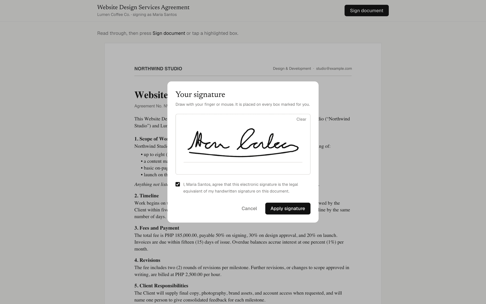
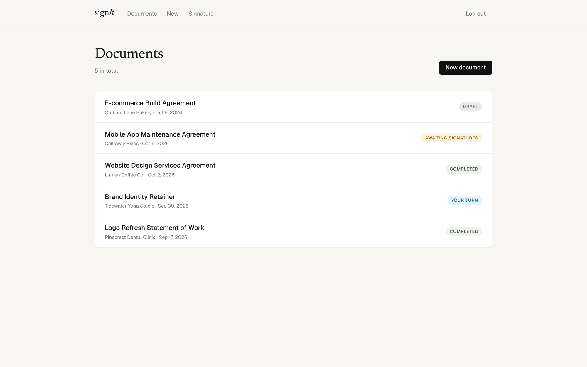
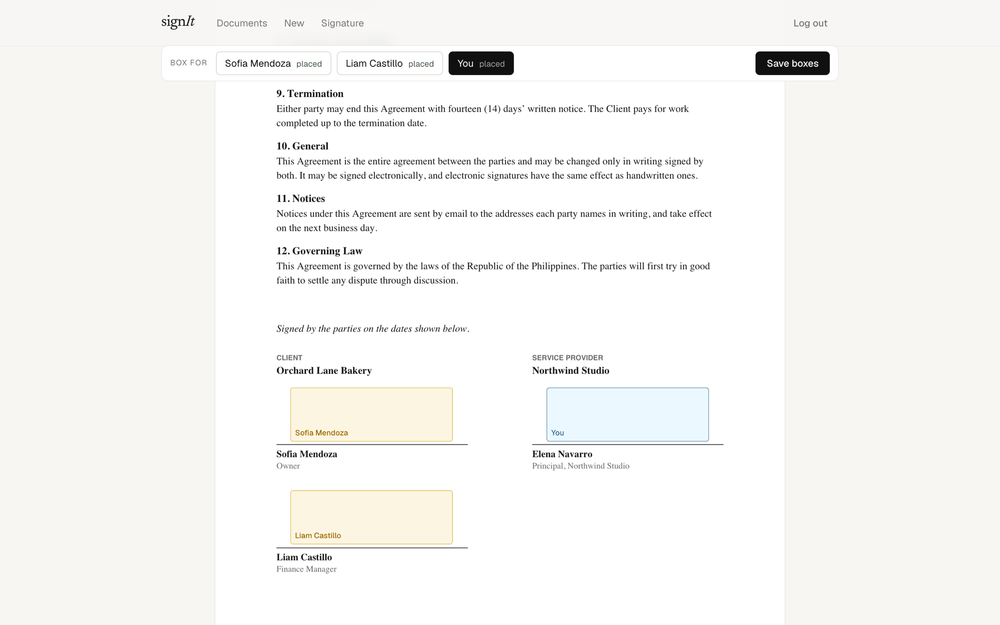
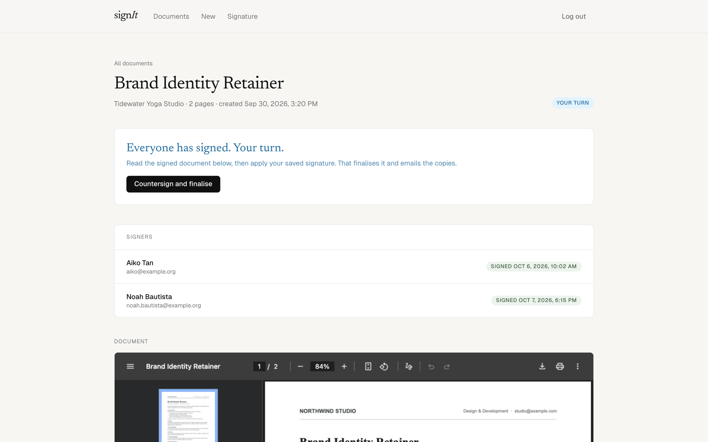
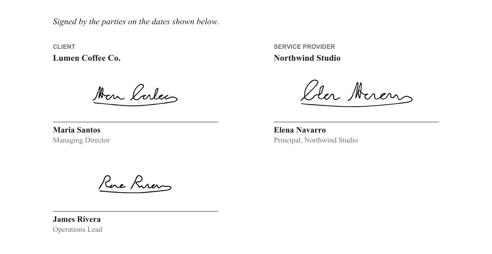
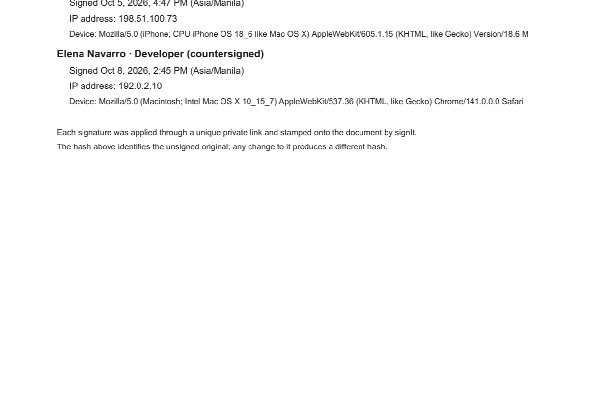
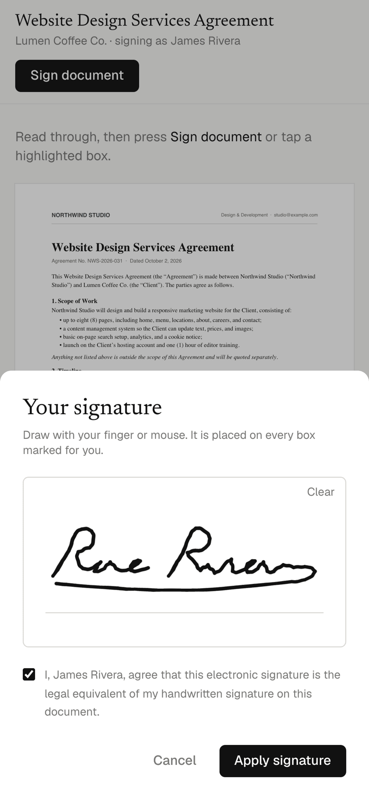

# signIt

Self-hosted e-signature for client agreements. Upload a PDF, place signature boxes, send each signer a private link, countersign with a saved signature, and get a finalised PDF with a signature certificate page.

One admin, as many signers as a document needs, and no accounts for signers: each one gets a private link.



## Stack

Next.js 16 on Vercel · Neon Postgres (Drizzle) · Vercel Blob (private) · Resend · pdf-lib · pdf.js · signature_pad

## Flow

1. **Admin** logs in with a magic link sent to `ADMIN_EMAIL`.
2. **New document**: upload the PDF, add signers (name, optional email).
3. **Place boxes**: pick a signer or yourself, click on the page, drag to adjust, save.
4. **Mark as sent**: one private link per signer appears. Send them however you like.
5. **Signer** opens the link, draws a signature, ticks consent, applies. The signature is stamped into every box marked for them.
6. When every signer is in, the document shows **Ready to countersign**. One click applies your saved signature.
7. A certificate page (signers, times, IPs, SHA-256 of the original) is appended, the final PDF is stored, and emailed to you and any signer with an email.

## Screenshots

| Every agreement and where it stands | Placing boxes for each signer |
|---|---|
|  |  |
| **Everyone has signed: your turn** | **The finalised signature page** |
|  |  |

<p>
  
  &nbsp;
  
</p>

All names, companies, and addresses in these screenshots are made up.

## Environment variables

| Name | Purpose |
|---|---|
| `ADMIN_EMAIL` | The only address that can log in |
| `AUTH_SECRET` | HMAC key for the session cookie. `openssl rand -hex 32` |
| `APP_URL` | Public origin, used in signing and login links |
| `MAIL_FROM` | Sender for Resend. Verify a domain in Resend to email clients |
| `DATABASE_URL` | Set by the Neon integration |
| `RESEND_API_KEY` | Set by the Resend integration |
| `BLOB_READ_WRITE_TOKEN` | Set by the Blob store connection |

## Commands

```bash
pnpm dev            # local server
pnpm db:push        # apply the schema to DATABASE_URL
pnpm build          # production build
vercel deploy --prod
```

## Notes

- Signing links never expire and carry no email verification. Add both when a client needs them: `signers.token` and `login_tokens` already model the pieces.
- Field positions are stored in PDF points with a bottom-left origin, the same frame pdf-lib stamps in.
- Blobs are private. The app proxies PDFs through `/api/documents/[id]/pdf` (admin) and `/api/sign/[token]/pdf` (signer).
